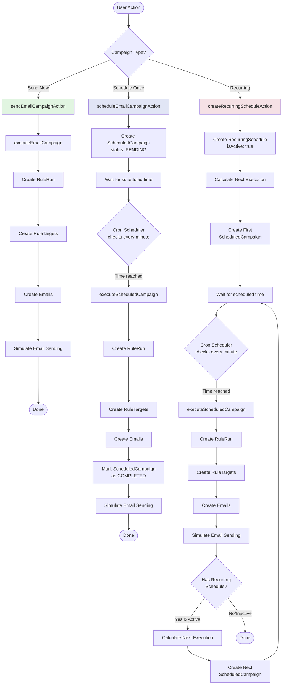

# Campaign Flow Diagram

This diagram shows the three different ways to execute email campaigns in the Rally system.

## Campaign Types

### 1. Send Now (Green Path)
- **Action**: `sendEmailCampaignAction`
- **Behavior**: Immediate execution
- **Use Case**: Send campaign right away
- **Flow**: Direct execution without any scheduling

### 2. Schedule Once (Blue Path)
- **Action**: `scheduleEmailCampaignAction`
- **Behavior**: Execute once at a specific time
- **Use Case**: Plan a campaign for a future date/time
- **Flow**: 
  - Creates a `ScheduledCampaign` with status `PENDING`
  - Cron scheduler checks every minute for due campaigns
  - Executes when time is reached
  - Marks as `COMPLETED` after execution

### 3. Recurring (Red Path)
- **Action**: `createRecurringScheduleAction`
- **Behavior**: Execute repeatedly on a schedule (daily, weekly, monthly)
- **Use Case**: Automated campaigns that run on a regular basis
- **Flow**:
  - Creates a `RecurringSchedule` with `isActive: true`
  - Calculates next execution time
  - Creates a `ScheduledCampaign` for next run
  - After execution, automatically creates the next scheduled campaign
  - Continues indefinitely until paused or stopped

## Common Execution Flow

All three paths eventually go through the same core execution steps:
1. **Create RuleRun**: Creates a record of the campaign execution
2. **Create RuleTargets**: Identifies which vehicles/customers to target
3. **Create Emails**: Generates email records for each target
4. **Simulate Email Sending**: Simulates the actual sending process

## Key Components

- **Cron Scheduler**: Runs every minute checking for due scheduled campaigns
- **executeScheduledCampaign**: Common execution function for both scheduled and recurring campaigns
- **calculateNextExecution**: Determines the next run time for recurring schedules

